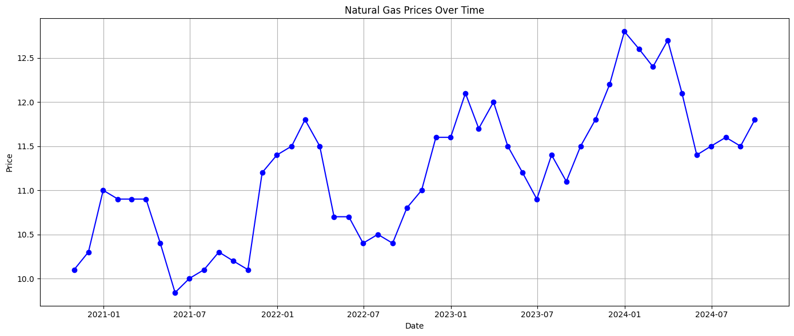

# Natural Gas Price Forecasting with SARIMA

An in-depth analysis and prediction of natural gas prices using the SARIMA (Seasonal AutoRegressive Integrated Moving Average) model.

## Introduction

Natural gas plays a crucial role in the global energy sector. Predicting its price can offer valuable insights for investors, policy-makers, and industries reliant on this energy source. This project showcases an end-to-end analysis of historical natural gas prices and forecasts future prices using the SARIMA model.

## Table of Contents
1. [Data Source and Preprocessing](#data-source-and-preprocessing)
2. [Exploratory Data Analysis](#exploratory-data-analysis)
3. [Time Series Decomposition](#time-series-decomposition)
4. [Modeling and Prediction](#modeling-and-prediction)
5. [Conclusion](#conclusion)
6. [Dependencies](#dependencies)
7. [Usage](#usage)
8. [Contributing](#contributing)

## Data Source and Preprocessing

The dataset used in this project comprises of monthly natural gas prices over a specified period. During preprocessing:
- Dates were converted to a standardized datetime format.
- Data was examined for missing values.

## Exploratory Data Analysis

Through visualization, I discerned the patterns and fluctuations in the natural gas prices. This helped inform the next stages of analysis.

## Time Series Decomposition

I decomposed the time series data to understand its underlying trend, seasonality, and residuals. 

## Modeling and Prediction

Using the SARIMA model, we:

1. Determined the order of differencing and the ARIMA terms using ACF and PACF plots.
2. Fitted the model and compared the actual values with the predicted ones for validation.
3. Forecasted natural gas prices for the next year.

## Conclusion

A brief summary of the project findings, potential implications, and any limitations of your approach.

## Dependencies

- pandas
- matplotlib
- statsmodels

(Add any other libraries or dependencies used in your project)

## Usage

Instructions on how someone can clone, set up, and run your project, if applicable.

## Contributing

If you wish to contribute to this project, please fork the repository and submit a pull request.
